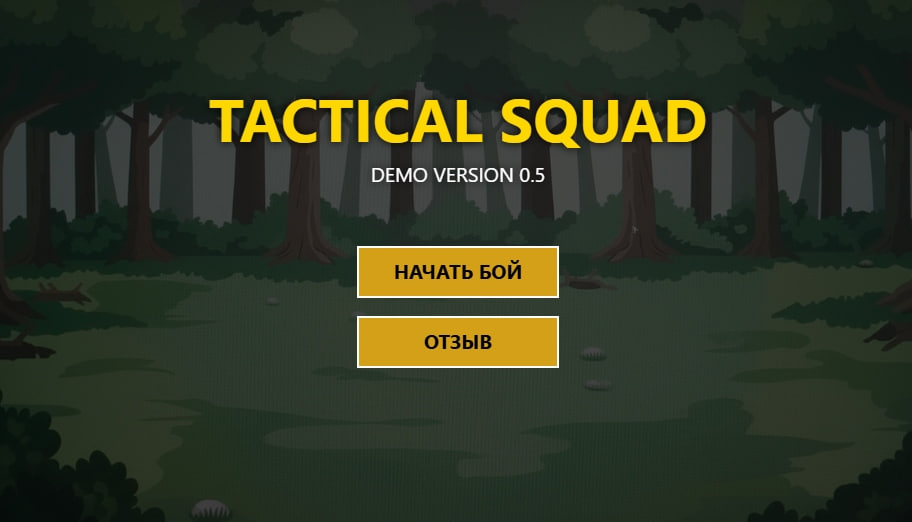

# ⚔️ Tactical Squad RPG Demo

**Tactical Squad** — это легковесная пошаговая тактическая RPG, написанная на чистом **JavaScript** и **HTML5 Canvas** без использования сторонних библиотек и игровых движков.

Проект представляет собой демо-версию боевой системы, где игрок управляет отрядом солдат против искусственного интеллекта.


*(Замените screenshot.png на реальный скриншот вашей игры)*

## ✨ Особенности

*   **Пошаговая система боя:** Очередь ходов, отображаемая в интерфейсе.
*   **Искусственный интеллект:** Враг выбирает цели, атакует и реагирует на ситуацию.
*   **Система характеристик:** Здоровье (HP) и Броня (Armor). Броня поглощает урон первой.
*   **Инвентарь:** Использование предметов (Аптечки, Гранаты) с кулдаунами или лимитом количества.
*   **Круговое меню:** Удобный выбор действий (Атака, Защита, Пропуск) прямо возле персонажа.
*   **Гибкая графика:** Поддержка как спрайтовой анимации, так и статичных изображений.
*   **Fallback-режим:** Если изображения не загружены, игра автоматически рисует геометрические фигуры, сохраняя играбельность.

## 🚀 Как запустить

Игра работает прямо в браузере. Вам не нужно устанавливать Node.js или другие зависимости.

1.  Скачайте репозиторий.
2.  Убедитесь, что файл с кодом называется `index.html` (или откройте ваш `.html` файл).
3.  Положите изображения `bg.png`, `player.png` и `enemy.png` в ту же папку (необязательно).
4.  Откройте файл в любом современном браузере (Chrome, Firefox, Edge).

> **Рекомендация:** Для корректной загрузки изображений лучше использовать локальный сервер (например, расширение "Live Server" в VS Code), так как браузеры могут блокировать загрузку картинок при открытии файла напрямую через протокол `file://`.

## 🎮 Управление

*   **Левый клик мыши:** Взаимодействие с меню и выбор целей.
*   **Ход игрока:**
    1.  Выберите действие в круговом меню (Меч) или в инвентаре снизу.
    2.  Выберите цель (Враг для атаки, Союзник для лечения).
*   **Действия:**
    *   ⚔️ **Атака:** Наносит урон выбранному врагу.
    *   🛡️ **Защита:** Восстанавливает часть брони.
    *   ⏭️ **Пропуск:** Передает ход следующему.
    *   💉 **Аптечка:** Лечит здоровье (HP).
    *   💣 **Граната:** Наносит большой урон игнорируя часть защиты.

## 🎨 Настройка графики (Спрайты)

Вы можете заменить стандартные изображения на свои.

1.  Поместите файлы в корневую папку:
    *   `bg.png` — Фон (рекомендуемый размер 960x540).
    *   `player.png` — Изображение солдата игрока.
    *   `enemy.png` — Изображение солдата врага.

2.  **Настройка режима анимации:**
    В коде игры (в начале скрипта) есть переменная:

    ```javascript
    // false = Статичная картинка (не будет моргать)
    // true  = Спрайт-лист (анимация кадров)
    const IS_SPRITE_SHEET = false; 
    ```

    *   Если у вас просто картинка персонажа — оставьте `false`.
    *   Если у вас спрайт-лист (сетка кадров) — поставьте `true` и настройте размеры кадра в классе `Unit` (`this.spriteW`, `this.spriteH`).

## 🛠 Технологии

*   **HTML5 Canvas** — Рендеринг графики.
*   **Vanilla JavaScript (ES6+)** — Логика игры, AI, управление состоянием.
*   **CSS3** — Базовая стилизация контейнера.

## 📝 Планы на будущее (Roadmap)

*   [ ] Добавление разных типов врагов.
*   [ ] Система уровней и прокачки.
*   [ ] Звуковые эффекты и музыка.
*   [ ] Анимации смерти и победы.

## 🤝 Обратная связь

Если у вас есть идеи или вы нашли баг, пишите в [Telegram Чате](https://t.me/TACTICALSQUADdemo).

---
*Created by [Cubic]*
